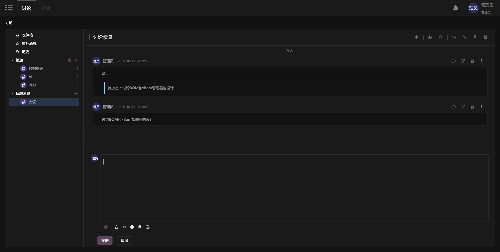
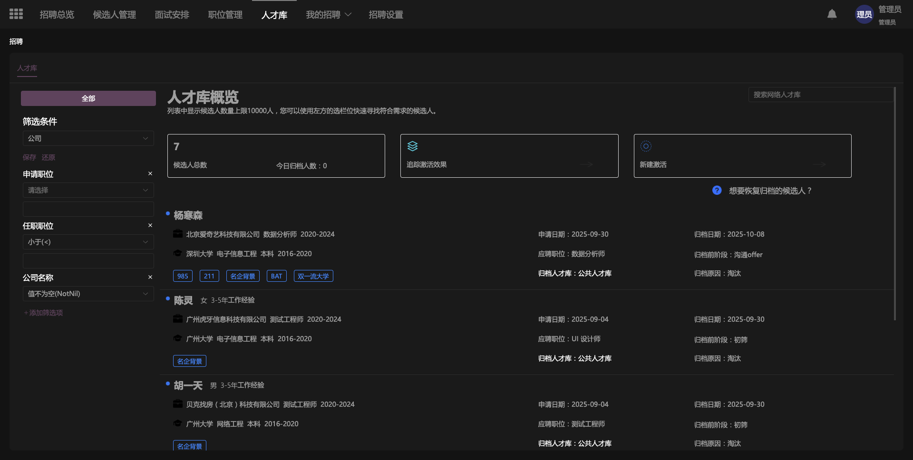

# 🧩 iBizOdoo — 基于 iBizModeling 打造的国产化可扩展业务套件

> ⚙ 一套 **可建模、可扩展、可重新定义的 Odoo 风格业务系统内核**  
> 🎯 基于 **iBiz Business Engine + DSL 模型驱动能力** 全面重构  
> 🚀 当前开放模块：**基础系统、员工管理、考勤管理、招聘管理**


为了让 **[iBizLab 开源实验室](https://www.ibizlab.cn)** 的开源业务系统具备**模块化拼装能力**。 我们打造了 **iBizOdoo** ——  

> ✅ 保留 Odoo 的「插件式模块架构」  
> ✅ 替换底层为 **iBiz Business Engine + DSL 模型运行时**  
> ✅ 提供真正适合本土业务快速重构/扩展的技术基座


## 🌐 在线体验

- **官方网站**: [https://www.ibizlab.cn](https://www.ibizlab.cn)
- **Demo 地址**：[https://odoo.ibizlab.cn/demo/](https://odoo.ibizlab.cn/demo/)
- **用户名 / 密码**：`demo_admin / 123456`
- **技术资料**: [https://odoo.ibizlab.cn/doc/](https://odoo.ibizlab.cn/doc/)
- **ModelingIDE** [https://odoo.ibizlab.cn/modeling/](https://odoo.ibizlab.cn/modeling/)


## 📦 当前开源模块列表

| 模块                                                | 状态 | 描述 |
|---------------------------------------------------|------|------|
| **系统基础模块**                                        | ✅ | 包含组织、部门、用户、权限等基础能力 |
| **员工管理（HR Core）**                                 | ✅ | 管理人员档案、组织关系、人事变更基础信息 |
| **[考勤模块](https://github.com/ibizlab/attendance)**  | ✅ | 支持排班、考勤规则配置、出勤数据记录和处理 |
| **[招聘模块](https://github.com/ibizlab/recruitment)** | ✅ | 岗位发布、候选人管理、面试流程跟踪 |

> 📌 所有模块均基于 **iBizModeling** 建模 → iBiz Service Runner 解释执行**，支持热加载/在线扩展，无需二次编码。


## ⚙ 技术特性亮点

- 🔌 **模块即插件** — 完全解耦，可独立启用 / 卸载 / 扩展
- 🧠 **DSL 模型驱动** — 通过模型描述 UI、流程、逻辑，无需硬编码
- 🔥 **动态加载 & 热生效** — 模型变更可直接影响运行系统
- 🔄 **支持模块继承 / Mixin 注入能力**（如日志、附件、消息流自动加入）
- 🌐 **国产化适配 / 轻量部署** — 支持 Docker、内网孤岛部署
- ⚡ **兼容对接 iBizModeling** — 可在建模平台中继续二开并生成专属业务系统

## 🗂 效果预览







## ⚡ 快速上手

### 环境要求
- CPU ≥ 4 核， RAM ≥ 16 GB， Disk ≥ 50 GB，Docker ≥ 24.0.0， Docker-Compose ≥ v2.26.1

### 安装步骤
```bash
# 克隆项目
git clone https://github.com/ibizlab/iBizOdoo.git

# 启动服务
cd iBizOdoo/deploy/compose
docker-compose up -d
```
[!CAUTION] 更详细安装说明参考 [install](deploy/compose/README.md)


## 🛠 定制开发

如果您需要在 iBizOdoo 的基础上进行 二次开发或行业定制，推荐使用 [iBizModeling](https://modeling.ibizlab.cn/) 在线实验室：


🔹 在线创建和编辑模型，无需本地安装

🔹 ModelingIDE中可视化建模配置，一键发布新模型

🔹 EHR系统自动加载模型变更，实时解释执行，支持快速验证

👉 [点击这里申请在线实验室](https://open.ibizlab.cn/plmweb/#/-/index/-/workspace_tab_exp_view/srfnav=oss/recent_oss_tree_exp_view/-/route-modal/dev_lab_apply_apply_edit_view/-)  免费使用

当然您也可以直接基于代码进行二次开发，代码由iBizCodeGenerator基于模型发布生成，支持高开修定

🔹 前端代码 👉[frontend](frontend) Vue 全家桶（Vue3、Vite、Element Plus、TSX），基于[iBizAppHub](https://github.com/ibizlab-cloud/ibiz-app-hub)开源技术框架实现

🔹 后台代码 👉[backend](backend) Springboot + Groovy微服务程序，基于[iBizServiceHub](https://github.com/ibizlab-cloud/ibiz-service-hub)开源技术框架实现


## ❤️ 加入我们

🌱 iBizOdoo 不是一个“成品系统”，而是一个 **可被社区一起扩展的业务引擎生态**。

**我们相信——国产业务系统的新一代技术范式，将由“建模 + 插件式模块引擎”驱动，而不是重复的 CRUD 开发。**


- 🌐 开源实验室官网：https://www.ibizlab.cn

- 💬 开源社区：https://open.ibizlab.cn

- 📱 微信公众号：iBiz开放平台

- 💬 QQ交流群：1056401976
 


# 🚀 iBiz Business Engine

一个基于iBiz Modeling模型驱动开发的现代化、模块化、可扩展的开源企业级应用模型框架，为构建ERP、CRM、SCM、PLM等复杂业务系统提供标准化的底层架构和核心服务。


&nbsp;核心定位: 这不是一个开箱即用的ERP，而是一个构建**企业级应用的标准化框架**, 如同Odoo的底层引擎，是为上层业务应用构建提供坚实基础。传统低代码平台缺乏构建复杂、可维护、企业级系统的指导，往往容易导致“快速搭建，快速腐化”。

该模型架构旨在提供了一套**契合iBiz Modeling系统模型生产标准化的设计框架和"黄金实践"**，强调“低代码，高架构”，定义了构建企业级应用的统一设计范式，确保系统的一致性、可维护性和可扩展性。与传统低代码平台与框架形成天然的技术壁垒。

&nbsp; 

&nbsp;

&nbsp;目标用户：

* 使用iBiz Modeling系统建模平台的所有开发者

* 软件开发商: 需要快速构建定制化企业应用的团队。

* 独立开发者: 希望基于成熟框架开发SaaS产品的个人或小团队。

* 企业IT部门: 需要内部构建或集成多个业务系统的大型组织。

* 希望深入学习企业级应用架构的开发者。


# 🧱 架构与设计理念


## 一、模块化与插件化


本框架在iBiz Modeling建模平台的强大能力支撑下，实现了一套的模块化开发与部署流程。将模块（插件）开发提升为一种高度并行、低耦合、可预测的“工业化生产”模式，开发者可以像构建独立的子系统一样进行开发，最终通过智能模型的“合成”与灵活的“部署”无缝集成到主系统中。甚至在系统一开始设计时并不具备AI相关能力，也可以在业务扩张后快速开发并引入。


### **核心流程与优势**


#### 1. **独立化模块开发**:

* 每个模块在开发阶段被视为一个**独立的系统**。开发者拥有完全的开发自由度和环境隔离。

* 这使得多个模块团队可以**并行开发**，互不影响，显著缩短整体项目周期，实现真正的“开发生产线”模式。


#### 2. **基于模型导出/导入的设计上下文同步**:

* **痛点解决**: 模块开发需要依赖主系统的数据模型、视图定义、业务逻辑等核心元素。

* **解决方案**: 通过平台提供的“**模型导出/导入**”功能，主系统可以将其关键的“上游模型”（如 `Customer`, `Product`, `Order` 等实体及其视图、字段、权限）打包并共享给模块开发者。

* **价值**: 模块开发者无需等待主系统完成，即可快速在本地环境中**同步并使用这些模型**，立即开始基于真实模型设计上下文的开发和功能确认，极大提升了开发便利性和准确性。


#### 3. **基于预占位元素的UI视图合成**:

* 利用建模平台的“**界面组装**”和“**预占位**”能力，实现UI的动态、无冲突集成。

* **机制**:

* 主系统或基础模块可以定义一个名为 `sales_order_mgr_view` 的“占位视图”。

* 任何模块（如“合同管理模块”、“物流跟踪模块”）在开发时，可以创建一个同名的视图，并将其内容（如“关联合同”按钮、“物流信息”面板）设计到这个占位视图中。

* **合成规则**: 在模块安装时，系统会根据预设的**优先级规则**（如按模块安装顺序、显式声明的优先级）自动将所有同名占位视图的“内容”进行**合并与覆盖**，最终形成一个完整的、集成的UI。

* 其他元素组件合成，树部件、表单、工具栏、按钮组，均可通过占位或附加的方式进行扩展合成，并且视图本身可由多元素复合面板定制设计，可灵活组装

* **价值**:

* **开发无依赖**: 模块开发者只需**约定好视图占位符的名称**，即可独立设计其UI扩展，无需关心其他模块是否已开发或如何开发。

* **避免冲突**: 消除了传统方式中因直接修改同一视图而导致的代码/配置冲突。

* **灵活扩展**: 主系统功能可以被任意数量的模块以“插件”形式丰富，形成强大的生态系统。

如图使用mail.thread整体部件作为占位。后续插件可以声明同名视图实现统一替换


#### 4. **双模式部署：模型合并（Model Merge） 与 模型挂载（Model Mount）**:

模块开发完成后，通过应用市场上架，支持两种部署模式，满足不同场景需求：


| 特性 | **模型合并（Model Merge）** | **模型挂载（Model Mount）** |
| :--- | :--- | :--- |
| **定位** | **复杂、深度集成**的模块应用。 | **轻量、附加式**的功能扩展。 |
| **集成方式** | 将模块的模型（实体、字段、视图、逻辑）以**附加覆盖**的形式，**深度集成**到主系统的数据模型和应用结构中。 | 模块模型**独立存在**，通过**主系统代理**的方式与主系统交互。 |
| **效果** | 集成后，模块功能与主系统**浑然一体**，如同在主系统内原生开发。数据关系紧密，交互直接。 | 模块功能作为“**附加层**”存在，保持一定的独立性。对于主系统操作常用于实体属性附加、业务流程前后置逻辑。 |
| **典型场景** | 完整的“项目管理”、“生产制造”、“人力资源”等大型业务模块。 | “客户信用评级”、“页面美化替换”、“发票OCR识别”等小型功能或服务。 |
| **安装/卸载** | 时间稍长，因为涉及模型结构的深度变更和数据迁移。 | 通常更快，操作更轻量。 |
| **UI合成** | **完全一致**。无论哪种模式，最终的UI界面都通过上述“占位合成”机制呈现，用户无感知差异。 |
| **扩展能力** | 两种模式均**完全支持**使用自定义代码（脚本、服务）进行深度扩展。 |


这套机制的核心价值在于：


* **极致的开发效率**: 并行开发 + 模型同步 + 无冲突UI设计 = 开发速度的飞跃。

* **强大的灵活性**: “模型合并”与“模型挂载”双模式，覆盖从轻量附加到重型应用的全场景。

* **卓越的可维护性**: 模块高度解耦，依赖清晰（通过模型同步和事件总线），易于升级、替换或卸载。

* **一致的用户体验**: 无论模块如何开发和部署，最终呈现给用户的UI是无缝集成、统一的。

* **生态构建基础**: 应用市场 + 双模式部署 + 占位合成，为构建第三方模块生态奠定了坚实基础。


## 二、基于“虚拟Mixin”的模型智能组装


在构建复杂业务系统时，我们常常遇到这样的场景：多个不同的业务实体（如销售订单、采购订单、项目任务、客户反馈）都需要具备**发送消息、管理附件、记录活动、被关注**等通用的“社交化”或“协作化”能力。如果为每个实体都重复开发这些功能，无疑是巨大的浪费。


我们从Odoo的`mail.thread`等经典设计中汲取灵感，并结合平台特性，实现了更强大的“**虚拟Mixin模型**”机制。这不仅仅是一个继承，更是一种**声明式的、可复用的“能力注入”**。


### **核心概念：什么是“虚拟Mixin”？**


*   **“虚拟” (Virtual)**: 它本身通常不直接对应一个独立的数据库表（或仅作为逻辑容器），而是一个**纯粹的功能集合**。

*   **“Mixin” (混入)**: 它像一个“功能包”或“能力模块”，可以被“混入”到任何需要它的业务实体中。

*   **“模型” (Model)**: 在我们的建模平台中，它是一个完整的、可被定义和管理的模型实体。


### **工作方式：声明即拥有**


#### 1.  **设计通用能力包**:

&nbsp;       *   我们创建一个名为 `mail.thread` (或类似 `mixin.collaboration`, `activity.mixin`) 的**虚拟Mixin模型**。

&nbsp;      *   在这个模型中，我们**一次性定义**所有与协作相关的：

&nbsp;       *   **数据模型**: `message` (消息实体), `attachment` (附件实体), `follower` (关注者) 以及它们之间的关系。

&nbsp;       *   **业务逻辑**: 发送消息的方法、计算未读消息数量、关联附件、添加/移除关注者等服务。

&nbsp;       *   **UI元素**: 消息列表视图、附件面板、关注者列表等（可通过预占位集成）。或是通过一个完整的视图将他们集成至一起再通过预占位方式集成

&nbsp;       *   **属性字段**: 如 `message_count`, `attachment_count`, `is_follower` 等需要在主实体上显示的计算字段。

&nbsp;       *

#### 2.  **在业务实体中“混入”能力**:

&nbsp;   *   当开发者设计一个真实的业务实体，比如 `sales.order` (销售订单) 时，他不需要从零开始。

&nbsp;   *   只需在模型设计中，**声明 `sales.order` 继承自 `mail.thread`**。

&nbsp;   *   在系统运行时，模型引擎会自动执行“**智能组装**”。它将 `mail.thread` 中定义的所有模型结构、逻辑和属性，**无缝地“注入”或“合并”到 `sales.order` 的模型定义中**。


#### 3.  **最终效果**:

&nbsp;   *   `sales.order` 实体**自动拥有了**发送消息、管理附件、显示消息计数等功能。

&nbsp;   *   开发者无需编写一行重复的代码或配置，即可让 `sales.order` 变得“可协作”。

&nbsp;   *   同样，`project.task` (项目任务) 或 `crm.lead` (销售线索) 也可以通过继承 `mail.thread` 获得完全相同的能力。


### **进阶：嵌套与组合，无限可能**


*   **嵌套继承**: 虚拟Mixin本身也可以继承其他虚拟Mixin。例如：

&nbsp;   *   `mixin.basic` (基础能力：创建/修改时间、审计)

&nbsp;   *   `mixin.activity` (活动流能力)

&nbsp;   *   `mixin.collaboration` (继承自 `mixin.activity`，增加消息、附件)

&nbsp;   *   `mixin.full` (继承自 `mixin.collaboration`，增加更多高级功能)

&nbsp;   *   业务实体可以根据需要，选择继承 `mixin.activity` 或更强大的 `mixin.collaboration`。

*   **组合式开发**: 开发者可以像搭积木一样，将多个不同的虚拟Mixin（如 `mail.thread`, `mixin.workflow`, `mixin.rating`）组合到一个业务实体上，快速构建出功能丰富的复合实体。


### **化繁为简，赋能创新**


通过“虚拟Mixin”模式，我们实现了：


*   **极致的代码及模型复用**: 通用功能“一次定义，处处使用”，彻底消灭重复劳动。

*   **飞一般般的开发速度**: 为新实体添加复杂能力，只需一个继承声明，开发效率飙升。

*   **一致的用户体验**: 所有具备“协作”能力的实体，其消息、附件等交互方式完全一致。

*   **灵活的架构**: 通过嵌套和组合，可以构建出满足各种复杂需求的能力体系。

*   **模型的组装**: 这是“模型驱动”理念的体现——通过声明继承关系，系统自动组装出最终的业务模型。


“虚拟Mixin”模式的使用是本框架“**低代码，高架构**”理念的完美体现：


*   **“低代码”体现在结果**: 对于业务开发者而言，为一个新实体（如 `hr.recruitment` 招聘申请）添加消息、附件等复杂功能，**仅需在建模界面勾选一个继承关系**，无需编写任何底层代码。这极大地降低了开发门槛和工作量，是“低代码”带来的**生产力飞跃**。

*   **“高架构”体现在设计**: 这一“简单操作”背后，是精心设计的**架构范式**：

&nbsp;   *   **关注点分离**: 通用的“协作能力”被清晰地隔离在 `mail.thread` 中，与具体的业务逻辑（如订单计算、任务分配）完全解耦。

&nbsp;   *   **单一职责原则**: `mail.thread` 只负责“消息总线协作”，`mixin.workflow` 只负责“流程”，职责明确。

&nbsp;   *   **可复用性与可维护性**: 通用能力集中管理。一旦 `mail.thread` 有安全更新或功能增强，所有继承它的业务实体都能自动受益，**维护成本趋近于零**。

&nbsp;   *   **可扩展性**: 通过嵌套继承和组合，可以构建出适应未来需求的复杂能力体系。


“虚拟Mixin”让我们在享受“低代码”便捷性的同时，**内建了“高架构”的基因**。它确保了应用在快速构建的同时，依然具备清晰、健壮、易于维护的底层结构，避免了“快速搭建，快速腐化”的命运。


回想一下，前面提到的模型导入/导出，社区贡献的通用能力（如mail.thread）可作为独立的‘能力模块’通过模型导入/导出在生态内高效**共享**，新项目一键继承即可获得成熟功能，极大加速开发并确保**跨项目一致性**，让模型的生命力得到进一步的提升


## 三、模型生命的延续——全生命周期的模型驱动


在传统的软件开发模式中，存在一个巨大的断层：**“设计态”** 和 **“运行态”** 是割裂的。


*   **设计态**: 开发者在IDE或建模工具中定义数据模型、表单、流程、逻辑。

*   **运行态**: 应用部署上线，用户开始使用。此时，大部分设计能力被“冻结”，任何变更都需要回到开发环境，由专业开发者修改、测试、重新部署——**流程漫长，成本高昂**


我们的框架彻底改变了这一模式，实现了 **“模型生命的延续”**。这意味着，在 `modeling模型设计平台` 上设计的**表单、流程、业务逻辑、属性等核心模型元素，其“设计能力”并未在应用上线后终结，而是无缝延续到了“运行侧”**。


### **如何实现？双引擎驱动**


#### 1.  **设计态引擎**:

&nbsp;   *   开发者在强大的 `iBiz Modeling建模平台` 建模平台中，进行初始的、复杂的系统构建。

&nbsp;   *   输出：核心业务模块、基础流程、通用模型。


#### 2.  **运行态引擎 - 模型生命的延续**:

&nbsp;   *   应用上线后，**用户（可以是业务管理员、超级用户，甚至是最终用户）可以在运行中的系统内，直接使用与设计态几乎一致的体验和能力，进行二次开发！**

&nbsp;   *   **关键工具**:

&nbsp;       *   **建模设计插件**: 一个轻量级、可选的插件，安装在生产环境或预生产环境中。它为授权用户提供了一个熟悉的、与主建模平台同源的**界面设计器、流程设计器和逻辑编辑器**。

&nbsp;       *   **预导出的模型模块**: 社区或官方提供的、经过验证的运行侧建模“功能包”，用户可以直接导入并进行修改，作为二次开发的起点。当然iBiz Business Engine框架中已经内置了一套运行侧二开建模模型。


### **运行侧二次开发的典型场景**


*   **表单微调**: 业务部门发现某个订单审批表单缺少一个关键字段。管理员无需联系开发团队，直接在运行系统中打开表单设计器，拖拽添加字段，设置校验规则，**即时生效**。

*   **流程敏捷迭代**: 市场活动需要一个临时的“优惠券发放”审批流程。市场经理可以基于一个预设的“简单审批”模板，快速修改节点、调整审批人，发布一个新流程，活动结束后再轻松移除。

*   **逻辑扩展**: 需要为某个报表增加一个复杂的计算指标、或定时任务或附加执行行为能力等。用户可以在运行时逻辑编辑器中，直接通过可视化建模的方式。

*   **属性动态配置**: 动态添加自定义属性（如为“产品”添加“环保等级”）并配置其可见性和可编辑性。


### **价值与优势**


*   **极致的敏捷性**: 业务需求的变化可以**在几分钟内**得到响应和实现，无需漫长的开发-测试-发布周期。

*   **赋能业务用户**: 将部分“低风险、高频率”的配置和开发能力下放给最懂业务的人，释放专业开发团队的生产力，让他们专注于更复杂的架构和核心功能。

*   **降低变更成本**: 避免了传统“变更->代码修改->回归测试->部署”的高成本流程。

*   **持续演进**: 应用不再是“静态”的，而是能随着业务发展而**有机生长**的“活系统”。

*   **用户体验一致性**: 运行时的设计器与开发时的设计器**体验一致**，学习成本低，用户无需学习两套工具。

*   **安全与管控**: 通过严格的**权限控制**（谁可以使用设计器？能修改什么范围？）和**版本管理/模型发布流程**，确保运行时修改的安全性和可控性，避免“失控的自由”。


### **从“交付软件”到“赋能创造”**


“模型生命的延续”不仅仅是一项技术能力，更是一种**理念的升华**。它标志着我们从“**交付一个固定的软件产品**”的模式，转向了“**提供一个持续进化的创造平台**”的模式。


> **想象一下**：你的应用上线后，它的“设计图纸”并没有被锁进档案柜，而是变成了一本开放的、活的“操作手册”。业务团队可以随时拿起笔，在上面进行安全的、受控的修改和创新。系统本身，成为了业务持续优化的**共创伙伴**。


这就是 `modeling模型设计平台` 与`iBiz Business Engine`的魔力——让模型的生命，从开发的第一个业务模型，一直延续到业务的每一个灵动的瞬间。


### 模型生命的延续能力的市场差异化

我们理解，将设计能力延伸至运行时并非独创。然而`modeling模型设计平台` 与`iBiz Business Engine`结合实现的“模型生命的延续”模式，在设计理念、实施方式和目标上，与那些简单地将完整建模环境暴露给运行时用户的系统，有着本质的区别和显著优势：


#### **1. 赋能而非裸奔**


*   **“完整建模”模式**: 往往是将一个功能完备、权限相对宽松的建模环境直接部署到生产服务器。这可能导致：

&nbsp;   *   **风险失控**: 任何拥有设计器权限的用户都可能进行高风险操作（如修改核心表结构、删除关键流程），极易导致系统崩溃或数据损坏。

&nbsp;   *   **质量失控**: 缺乏有效的代码/模型审查机制，低质量的修改可能被直接发布。

&nbsp;   *   **“混乱的自由”**: 系统可能迅速变得难以维护，陷入“谁都能改，但没人敢动”的困境。

*   **我们的“模型生命延续”模式**: 我们提供的是一个**受控的、有层次的赋能环境**。

&nbsp;   *   **轻量级插件**: “建模设计插件”是可选的、轻量的，只包含**必要的、安全的**设计功能（如表单微调、流程节点增减、逻辑脚本编辑），而非完整的、可能带来破坏的底层建模能力。

&nbsp;   *   **严格的权限与范围控制**: 权限系统精确到“**能修改什么模型**”、“**能使用哪些设计器功能**”。例如，HR管理员只能修改HR模块的表单，不能触碰财务模型。


#### **2. 实施方式：延续而非复制**


*   **“完整建模”模式**: 有时意味着在生产环境部署一个与开发环境**功能完全一致**的、独立的建模实例。这可能导致：

&nbsp;   *   **资源浪费**: 运行时环境需要承载一个完整的、可能大部分时间闲置的建模引擎。

&nbsp;   *   **版本同步难题**: 运行时的修改如何与开发环境的主干代码/模型同步？容易产生“分支污染”。

*   **我们的“模型生命延续”模式**: 我们强调“**延续**”。运行时的设计器是**同一套模型引擎能力的延伸**，它直接作用于运行中的模型实例。

&nbsp;   *   **技术同源**: 运行时插件与主建模平台共享核心引擎和渲染技术，确保**体验和行为的一致性**。

&nbsp;   *   **模型即代码友好**: 运行时的变更（如果需要）可以被导出为模型定义文件（如JSON），纳入版本控制系统（Git），与开发环境的变更进行**有序的合并与管理**，形成真正的DevOps闭环。


#### **3. 目标用户与场景：精准赋能**


*   **“完整建模”模式**: 可能模糊了“开发者”和“业务用户”的界限，期望业务用户承担复杂的系统设计工作，这往往不切实际。

*   **我们的“模型生命延续”模式**: 我们的目标非常清晰：

&nbsp;   *   **主要用户**: **业务管理员、超级用户**。他们熟悉业务，但不一定是专业开发者。

&nbsp;   *   **主要场景**: **高频、低风险、业务导向的微调与扩展**。如：调整表单字段、增加一个计算公式、基于模板创建流程。不是为了让业务用户从零开始构建一个复杂的ERP模块。那是“设计态”开发者的职责。


#### **4. 生态协同：社区模块的“运行时热插拔”**


*   结合之前提到的“**预导出的模型模块**”和“**应用市场**”，我们的模式更进一步：

&nbsp;   * 用户不仅能在运行时**修改**现有主系统的模型，用户在市场里安装业务模块插件，也可以立即在运行时环境中被**查看、配置、甚至进行二次修改**（在权限允许下）。

&nbsp;

#### **5.模型语言一致性——构建双向演进的闭环生态**


“模型生命延续”的终极目标，不仅是让设计能力在运行时可用，更要确保**在运行时产生的价值能够反哺和滋养整个系统生态**。这依赖于一个核心基石：**模型语言一致性 **。


#### **核心机制：无缝的“运行态 -> 设计态”回流**


*   **统一的模型定义**: 无论是最初在“设计态”由专业开发者创建的模型，还是在“运行态”由业务管理员通过“建模设计插件”进行的二次开发（如修改的表单、优化的流程、新增的逻辑），它们都使用**完全相同的底层模型语言和数据结构**来描述。

*   **一键“回流”**: 当一个在运行时创建或修改的模型（例如，一个经过业务验证的高效“紧急采购审批流程”）被证明非常成功时，其拥有者或管理员可以执行一个简单的操作—— **“提升为设计态资产”**。这个在业务实践中“生长”出来的优秀模型，会**具备转换**为一个标准的、与设计态模型**格式完全一致**的“模型模块包”。


#### **“回流”带来的革命性价值**


##### 1.  **知识沉淀与复用**:

&nbsp;   *   业务一线的最佳实践（如某个高效的审批模式、一个精准的数据校验规则）不再随着某个用户的离职或项目的结束而消失。

&nbsp;   *   它们被**固化为可复用的数字资产**，可以被**分享**到团队、部门，甚至整个企业或社区的应用市场。


##### 2.  **社区驱动的创新**:

&nbsp;   *   这创造了“**用户即贡献者**”的良性循环。任何用户都可以成为创新的源头。

&nbsp;   *   社区应用市场不再是官方或专业开发者的“专利”，而是**所有用户智慧的结晶**。最接地气、最实用的功能模块将从真实的业务场景中涌现并被广泛传播。


##### 3.  **持续优化产品本身**:

&nbsp;   *   平台团队可以通过分析哪些“运行时诞生”的模块被最广泛地分享和使用，来洞察用户的真实需求和痛点。

&nbsp;   *   这些来自一线的“成功案例”可以**直接反向指导**平台核心功能的迭代和优化，甚至被吸纳为**标准功能**。


##### 4.  **降低专业开发者的负担**:

&nbsp;   *   专业开发者不再需要预设所有可能的业务场景。他们可以专注于构建强大的基础能力和通用框架。

&nbsp;   *   大量的长尾需求和业务变体，由业务用户在运行时解决，并通过“回流”形成可复用的模块，**极大地丰富了整体解决方案库**。


# **基于先进架构的标准化企业能力**


得益于上述先进的模块化与模型驱动架构，本框架**内建**了一套完整、标准的企业级基础能力。这些能力并非孤立的功能堆砌，而是核心架构理念的**直接体现和开箱即用的成果**：


*   **精细化权限管理**: 基于“统一资源”模型，实现菜单、视图、按钮、数据等元素的**全链路**访问控制。从建模平台构建的权限能力将同步安装到系统中，并且通过增强的权限继承框架，与访问控制体系实现与odoo系统别无二至的权限管理能力。

*   **灵活的组织与人员管理**: 支持多层级组织架构、岗位、用户、角色的定义与管理，为权限、流程、数据隔离提供基础支撑。

*   **配置管理**: 系统级、用户级、模块级配置的存储与管理。

*   **通用消息协作能力**: 通过 `mail.thread` 等虚拟Mixin，为所有业务实体**一键赋予**消息、附件、活动流、关注者等社交化功能。

*   **基础业务流程引擎**: 支持可视化流程定义与执行，与业务模型深度集成。

*   **数据主档与报表**: 提供基础的数据管理、查询与报表能力。

*   **事件总线 (Event Bus)**: 提供事件总线管理入口


这些基础能力本身也是以**模块化**的形式存在，并充分利用了**虚拟Mixin**进行构建。系统通过事件总线 (Event Bus) 实现模块间的松耦合通信（如“订单创建”事件触发“库存扣减”或“消息通知”），确保了系统的灵活性与可扩展性。因此，它们不仅开箱即用，更能作为**最佳实践的模板**，通过“**模型生命的延续**”机制，在运行时被轻松扩展、修改，并将优化后的成果**回流**为新的可复用资产，持续反哺整个平台生态。


# 🌱 结语


iBiz Business Engine的设计远不止于提供一套标准化框架，其深层目标是构建一个支持企业数字化业务持续演进、高效协同、智慧共生的“进化型生态系统”。这三大理念并非孤立存在，而是形成了强大的协同效应：

1.  **模块化是载体**：模块化提供了“能力”和“实践”流通的**标准化容器**（模型模块包）。

2.  **Mixin是基因**：虚拟Mixin是模块内部最核心的**可复用“基因”**，是构建模块的“乐高积木”。

3.  **生命延续是循环**：“模型生命的延续”机制是驱动整个生态运转的**永动机**。它让在模块中诞生的优秀Mixin或完整模块，能够从运行现场反哺到设计源头，再通过模块化分发给更多用户，形成生生不息的创新循环。

`iBiz Business Engine` 框架的终极目标，是让企业级应用开发从传统的“**瀑布式交付**”或“**单向赋能**”模式，进化为一个**由开发者、业务用户、社区共同参与的“共创、共享、共进”的有机生态**。

*   **对开发者**：提供强大的“工业化工具”和“智慧积木”，专注于高价值创新。

*   **对业务用户**：赋予安全、直观的“改装车间”，能自主优化工作流。

*   **对组织/社区**：沉淀集体智慧，形成可复用的“能力资产库”，实现知识的持续增值。


