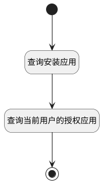

## cur_user_app <!-- {docsify-ignore-all} -->

   包含校验权限

### 处理过程




### 处理步骤说明

#### 开始 :id=Begin<sup class="footnote-symbol"> <font color=gray size=1>[开始]</font></sup>


*- N/A*
#### 查询安装应用 :id=DEDATASET_01<sup class="footnote-symbol"> <font color=gray size=1>[实体数据集]</font></sup>


调用实体 [模块(IR_MODULE_MODULE)](module/base/ir_module_module.md) 数据集合 [已安装应用(installed_app)](module/base/ir_module_module#数据集合) ，查询参数为`Default(传入变量)`

将执行结果返回给参数`installed_modules(已安装应用)`

#### 查询当前用户的授权应用 :id=RAWSFCODE_01<sup class="footnote-symbol"> <font color=gray size=1>[直接后台代码]</font></sup>


<p class="panel-title"><b>执行代码[Groovy]</b></p>

```groovy
def installedModules = logic.param('installed_modules').getReal();
def accessModules = logic.param('access_modules').getReal();

def accessManager = sys.getSystemAccessManager();
def currentUser = sys.user();

accessModules = installedModules?.findAll { module ->
    def resCode = module?.get("res_code")
    resCode == null || accessManager.testSysUniRes(currentUser, resCode)
} ?: []
```

#### 结束 :id=END_01<sup class="footnote-symbol"> <font color=gray size=1>[结束]</font></sup>


返回 `access_modules(已授权应用)`


### 实体逻辑参数

|    中文名   |    代码名    |  数据类型    |  实体   |备注 |
| --------| --------| -------- | -------- | --------   |
|传入变量(<i class="fa fa-check"/></i>)|Default|过滤器|||
|已授权应用|access_modules|分页查询|||
|已安装应用|installed_modules|分页查询|||
