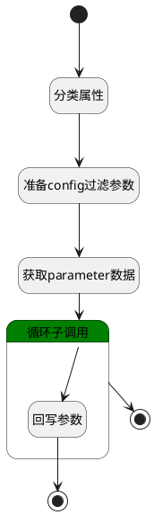

## 默认获取数据逻辑 <!-- {docsify-ignore-all} -->

   

### 处理过程




### 处理步骤说明

#### 分类属性 :id=RAWSFCODE_01<sup class="footnote-symbol"> <font color=gray size=1>[直接后台代码]</font></sup>


<p class="panel-title"><b>执行代码[Groovy]</b></p>

```groovy
  def defaultListParam = []
  def moduleListParam= []
  def groupListParam= []
  def  configListParam= []
  
  // 获取实体运行时对象（通过逻辑参数中的实体参数）
  def _default = logic.param("Default")
  def entityRuntime = _default.getDataEntityRuntime()
  
  // 遍历属性进行分类
  entityRuntime.getPSDEFields(true).each { field ->
    def _name = field.getName()
    def fieldtag = field.getUserTag()
    if(_name.startsWith('default_')) {
      defaultListParam.add(_name)
    } else if(_name.startsWith('module_')) {
      moduleListParam.add(_name)
    } else if(_name.startsWith('group_')) {
      groupListParam.add(_name)
    } else if(fieldtag != null && fieldtag.startsWith('config_parameter')) {
      configListParam.add(_name)
    }
  }
  
  // 绑定更新后的列表到参数（如果需要显式绑定）
  logic.param("defaultList").bind(defaultListParam)
  logic.param("moduleList").bind(moduleListParam)
  logic.param("groupList").bind(groupListParam)
  logic.param("configList").bind(configListParam)

```

#### 开始 :id=Begin<sup class="footnote-symbol"> <font color=gray size=1>[开始]</font></sup>


*- N/A*
#### 准备config过滤参数 :id=PREPAREPARAM_01<sup class="footnote-symbol"> <font color=gray size=1>[准备参数]</font></sup>


1. 将`configList(config_前缀属性列表)` 设置给  `parameter_filter(存储参数过滤).n_key_in`
2. 将`1000` 设置给  `parameter_filter(存储参数过滤).size`

#### 获取parameter数据 :id=DEDATASET_01<sup class="footnote-symbol"> <font color=gray size=1>[实体数据集]</font></sup>


调用实体 [系统参数(IR_CONFIG_PARAMETER)](module/base/ir_config_parameter.md) 数据集合 [DEFAULT](module/base/ir_config_parameter#数据集合) ，查询参数为`parameter_filter(存储参数过滤)`

将执行结果返回给参数`parameter_list(parameter列表)`

#### 循环子调用 :id=LOOPSUBCALL_01<sup class="footnote-symbol"> <font color=gray size=1>[循环子调用]</font></sup>


循环参数`parameter_list(parameter列表)`，子循环参数使用`parameter_temp(参数对象)`
#### 结束 :id=END_02<sup class="footnote-symbol"> <font color=gray size=1>[结束]</font></sup>


返回 `Default(传入实体参数)`

#### 回写参数 :id=RAWSFCODE_02<sup class="footnote-symbol"> <font color=gray size=1>[直接后台代码]</font></sup>


<p class="panel-title"><b>执行代码[Groovy]</b></p>

```groovy
def _default = logic.param("Default").getReal()
def parameter_temp = logic.param("parameter_temp").getReal()
_default.set(parameter_temp.get("key"),parameter_temp.get("value"))
```

#### 结束 :id=END_01<sup class="footnote-symbol"> <font color=gray size=1>[结束]</font></sup>


*- N/A*


### 实体逻辑参数

|    中文名   |    代码名    |  数据类型    |  实体   |备注 |
| --------| --------| -------- | -------- | --------   |
|传入实体参数(<i class="fa fa-check"/></i>)|Default|数据对象|[配置设定(RES_CONFIG_SETTINGS)](module/base/res_config_settings.md)||
|config_前缀属性列表|configList|简单数据列表|||
|default_前缀属性列表|defaultList|简单数据列表|||
|group_前缀属性列表|groupList|简单数据列表|||
|module_前缀属性列表|moduleList|简单数据列表|||
|存储参数过滤|parameter_filter|过滤器|||
|parameter列表|parameter_list|分页查询|||
|参数对象|parameter_temp|数据对象|[系统参数(IR_CONFIG_PARAMETER)](module/base/ir_config_parameter.md)||
