## 重置确认 <!-- {docsify-ignore-all} -->

   

### 处理过程

```plantuml
@startuml
hide empty description
<style>
root {
  HyperlinkColor #42b983
}
</style>

hide empty description
state "开始" as Begin <<start>> [[$./set_draft#begin {"开始"}]]
state "变更状态" as PREPAREPARAM_01  [[$./set_draft#prepareparam_01 {"变更状态"}]]
state "更新状态" as DEACTION_01  [[$./set_draft#deaction_01 {"更新状态"}]]
state "结束" as END_01 <<end>> [[$./set_draft#end_01 {"结束"}]]


Begin --> PREPAREPARAM_01
PREPAREPARAM_01 --> DEACTION_01
DEACTION_01 --> END_01


@enduml
```

### 处理步骤说明

#### 开始 :id=Begin [开始]

*- N/A*
#### 变更状态 :id=PREPAREPARAM_01 [准备参数]

1. 将`draft` 设置给  `Default(传入变量).STATE(状态)`

#### 更新状态 :id=DEACTION_01 [实体行为]

调用实体 [收件服务器(FETCHMAIL_SERVER)](module/mail/fetchmail_server.md) 行为 [Update](module/mail/fetchmail_server#行为) ，行为参数为`Default(传入变量)`

将执行结果返回给参数`Default(传入变量)`

#### 结束 :id=END_01 [结束]

*- N/A*

### 实体逻辑参数

|    中文名   |    代码名    |  数据类型    |  实体   |备注 |
| --------| --------| -------- | -------- | --------   |
|传入变量(<i class="fa fa-check"/></i>)|Default|数据对象|[收件服务器(FETCHMAIL_SERVER)](module/mail/fetchmail_server.md)||
