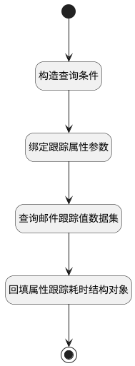

## 计算跟踪属性耗时 <!-- {docsify-ignore-all} -->

   

### 处理过程




### 处理步骤说明

#### 开始 :id=Begin<sup class="footnote-symbol"> <font color=gray size=1>[开始]</font></sup>


*- N/A*
#### 构造查询条件 :id=RAWSFCODE_01<sup class="footnote-symbol"> <font color=gray size=1>[直接后台代码]</font></sup>


<p class="panel-title"><b>执行代码[Groovy]</b></p>

```groovy
// 获取默认参数对象
def _default = logic.param("Default").getReal()
// 获取过滤器参数实际对象
def filterEntity = logic.param("filterParam").getReal()

// 获取子实体运行时
def childDataDataEntityRuntime = net.ibizsys.runtime.util.DataEntityRuntimeHolder.peekChildDataEntityRuntime()

//获取跟踪属性名
def filterField = "__None__"
def psDEFieldList = childDataDataEntityRuntime.getPSDataEntity().getAllPSDEFields();
if(!org.springframework.util.ObjectUtils.isEmpty(psDEFieldList)) {
  for(def iPSDEField : psDEFieldList) {
      String strTag = iPSDEField.getFieldTag();
      if (!org.springframework.util.StringUtils.hasLength(strTag)) {
          continue;
      }
      if("DURATION_TRACK".equals(strTag)){
        filterField = iPSDEField.getName();
        break;
      }
  }
}

// 直接设置属性值
filterEntity.set("n_res_id_eq", _default.get("id"))
filterEntity.set("n_model_eq", childDataDataEntityRuntime.getName())
filterEntity.set("n_field_id_eq", filterField)
filterEntity.set("size", 100)

```

#### 绑定跟踪属性参数 :id=BINDPARAM_01<sup class="footnote-symbol"> <font color=gray size=1>[绑定参数]</font></sup>


绑定参数`filterParam(过滤器参数)` 到 `tracking_field(跟踪属性)`
#### 查询邮件跟踪值数据集 :id=DEDATASET_01<sup class="footnote-symbol"> <font color=gray size=1>[实体数据集]</font></sup>


调用实体 [邮件跟踪值(MAIL_TRACKING_VALUE)](module/mail/mail_tracking_value.md) 数据集合 [DEFAULT](module/mail/mail_tracking_value#数据集合) ，查询参数为`filterParam(过滤器参数)`

将执行结果返回给参数`resultList(查询结果列表)`

#### 回填属性跟踪耗时结构对象 :id=RAWSFCODE_02<sup class="footnote-symbol"> <font color=gray size=1>[直接后台代码]</font></sup>


<p class="panel-title"><b>执行代码[Groovy]</b></p>

```groovy
// 获取默认参数对象
def _default = logic.param("Default").getReal()
def resultList = logic.param("resultList").getReal()
def tracking_field = logic.param("tracking_field").getReal()
def durationMap = [:]
def trackValueList = []
trackValueList.addAll(resultList)
 // 添加当前值的“假”跟踪记录
 if(_default.get(tracking_field)){
    trackValueList.add([
        create_date: net.ibizsys.runtime.util.DateUtils.getCurTime(),
        old_value_char: _default.get(tracking_field)
    ])
}
def previousDate = _default.get("create_date").toLocalDateTime()
// 计算每个阶段的持续时间
trackValueList.each { tracking ->
    def oldId = tracking.old_value_char
    def createDate = tracking.create_date.toLocalDateTime()

    long duration = java.time.temporal.ChronoUnit.SECONDS.between(previousDate, createDate)
    durationMap.putIfAbsent(oldId, 0L)
    durationMap[oldId] += duration

    previousDate = createDate
}
_default.set("duration_tracking",durationMap)

```

#### 结束 :id=END_01<sup class="footnote-symbol"> <font color=gray size=1>[结束]</font></sup>


返回 `Default(传入变量)`


### 实体逻辑参数

|    中文名   |    代码名    |  数据类型    |  实体   |备注 |
| --------| --------| -------- | -------- | --------   |
|传入变量(<i class="fa fa-check"/></i>)|Default|数据对象|[邮件跟踪值(MAIL_TRACKING_VALUE)](module/mail/mail_tracking_value.md)||
|过滤器参数|filterParam|过滤器|||
|查询结果列表|resultList|数据对象列表|[邮件跟踪值(MAIL_TRACKING_VALUE)](module/mail/mail_tracking_value.md)||
|跟踪属性|tracking_field|简单数据|||
